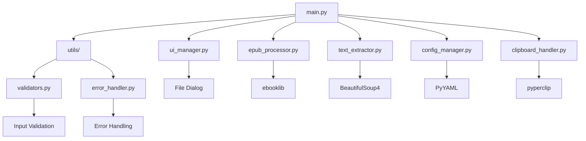

# ChapterClip

A Python CLI tool that extracts and copies a user-defined word count from EPUB files starting from a specified chapter. The tool provides a clean, HTML-free text extraction that automatically calculates and includes complete chapters up to a maximum word limit.

## Overview

ChapterClip is designed to provide readers with an efficient way to extract and copy manageable portions of their EPUB books for reading, note-taking, or text processing purposes. It supports standard EPUB formats and ensures clean text output without HTML artifacts.

### Vision Statement
To provide readers with an efficient way to extract and copy manageable portions of their EPUB books for reading, note-taking, or text processing purposes.

### Target Users
- Digital readers who want to extract specific portions of books
- Students needing to copy text segments for study purposes
- Researchers extracting book content for analysis
- Content creators who need clean text from EPUBs

## Features

- **EPUB File Selection**: GUI file picker dialog for EPUB selection with validation
- **Improved Chapter Detection**: Automatically excludes non-chapter content based on filename patterns and content length
- **Chapter Selection**: Numeric input for chapter number with title confirmation
- **Counting Mode**: Choose between word counting or LLM token-based counting, with user-configurable limits
- **Text Extraction**: Extracts complete chapters only, removes HTML tags, preserves formatting
- **Warning Suppression**: Suppresses XML parsing warnings for cleaner output
- **Logging Configuration**: Configurable logging levels via config.yaml
- **Output Management**: Direct copy to system clipboard with extraction summary
- **User Interface**: Interactive CLI menu system with progress indicators
- **Cross-Platform**: Supports Windows, macOS, and Linux

## Counting Mode

ChapterClip supports two counting modes for determining text extraction limits: **words** and **tokens**.

### Word Counting
The default mode that counts individual words in the extracted text. This mode ensures backward compatibility with existing configurations and behavior.

### Token Counting
Uses LLM tokenization (via Google Generative AI) to count tokens instead of words. This is particularly useful for users working with AI models that have token-based limits rather than word limits.

### Configuration
Users can configure the counting mode through:
- **UI Config Menu**: Select option 2 (Configure settings) and choose the desired counting mode
- **config.yaml**: Set the `counting_mode` field to either `'words'` or `'tokens'`

### Dependencies and Fallback
Token counting requires the `google-generativeai` library. If this dependency is unavailable, the tool automatically falls back to word counting to ensure uninterrupted functionality.

**Backward Compatibility**: Existing installations default to word counting, preserving existing behavior unchanged.

## Architecture



The project follows a modular architecture with separate components for UI management, EPUB processing, text extraction, configuration, clipboard handling, input validation, and error handling.

## Installation

### Prerequisites
- Python 3.8 or higher

### Dependencies
Install the required packages using pip:

```bash
pip install ebooklib>=0.18 beautifulsoup4>=4.11.0 pyperclip>=1.8.2 click>=8.1.0 rich>=13.0.0 pyyaml>=6.0 lxml>=4.9.0
```

**Optional Dependencies**:
- `google-generativeai`: Required for token-based counting (automatic fallback to word counting if unavailable)

### Setup
1. Clone the repository:
   ```bash
   git clone https://github.com/username/chapterclip.git
   cd chapterclip
   ```

2. Install dependencies:
   ```bash
   pip install -r requirements.txt
   ```

3. Run the application:
    ```bash
    python main.py run
    ```

## Usage

Launch the application with:
```bash
python main.py run
```

### Main Menu
```
═══════════════════════════════════════════
        ChapterClip - EPUB Text Extractor
═══════════════════════════════════════════

Please select an option:

  [1] Extract chapters from EPUB
  [2] Configure settings
  [3] View current settings
  [4] Exit

Enter your choice (1-4): _
```

### Chapter Extraction Flow
1. Select option 1
2. Choose an EPUB file via the file picker
3. Enter the chapter number to start from
4. Confirm the chapter title
5. The tool extracts complete chapters up to the word limit and copies to clipboard

### Settings Configuration
- Select option 2 to configure word count and other settings
- Settings are persisted in `config.yaml`

## Configuration

Configuration is stored in `config.yaml`:

```yaml
settings:
  max_words: 20000
  counting_mode: words
  include_chapter_titles: true
  preserve_paragraph_breaks: true
  last_epub_directory: ""
  log_level: INFO
```

- `max_words`: Maximum count for extraction (words or tokens, depending on counting_mode; default: 20,000)
- `counting_mode`: Counting method ('words' or 'tokens'; default: 'words')
- `include_chapter_titles`: Whether to include chapter titles in output
- `preserve_paragraph_breaks`: Maintain paragraph structure in extracted text
- `last_epub_directory`: Remembers the last directory used for file selection
- `log_level`: Logging level (DEBUG, INFO, WARNING, ERROR, CRITICAL)

## Examples

### Basic Extraction
```
━━━━━━━━━━━━━━━━━━━━━━━━━━━━━━━━━━━━━━━
Selected Chapter Confirmation
━━━━━━━━━━━━━━━━━━━━━━━━━━━━━━━━━━━━━━━

Chapter 17: "The Journey Continues"

Is this the correct chapter? (y/n): y

━━━━━━━━━━━━━━━━━━━━━━━━━━━━━━━━━━━━━━━
Extraction Complete!
━━━━━━━━━━━━━━━━━━━━━━━━━━━━━━━━━━━━━━━

✓ Successfully extracted and copied to clipboard

Details:
  • Chapters included: 17-24 (8 chapters)
  • Total words: 19,850
  • Maximum allowed: 20,000

Press Enter to return to main menu...
```

### Settings View
Select option 3 to view current configuration:

```
Current Settings:
━━━━━━━━━━━━━━━━━━━━━━━━━━━━━━━━━━━━━━━
Max Words: 20000
Include Chapter Titles: True
Preserve Paragraph Breaks: True
Last EPUB Directory: /path/to/last/directory
```

## Troubleshooting

### Common Issues

- **Invalid EPUB file**: Ensure the file is a valid EPUB (EPUB 2.0 or 3.0). The tool will display an error if the file is corrupted or not an EPUB.

- **Chapter not found**: Verify the chapter number exists in the EPUB. The tool shows available chapter ranges for invalid inputs.

- **Clipboard access denied**: On some systems, clipboard access may be restricted. The tool will offer to display text in the terminal as an alternative.

- **Corrupted EPUB structure**: For damaged files, the tool will attempt graceful degradation and show a warning about potential issues.

### Performance
- Standard EPUB files (<10MB) should process in under 5 seconds
- Ensure sufficient RAM for large EPUBs
- Close other memory-intensive applications if experiencing slowdowns

### Compatibility
- Requires Python 3.8+
- Tested on Windows, macOS, and Linux
- Supports UTF-8 encoded EPUBs

## Contributing

Contributions are welcome! Please feel free to submit pull requests or open issues for improvements.

## License

This project is licensed under the MIT License - see the [LICENSE](LICENSE) file for details.

## Future Enhancements

- Multiple EPUB batch processing
- Export to various formats (TXT, MD, DOCX)
- Reading progress tracking
- Chapter bookmarking
- Custom extraction patterns
- Integration with cloud storage
- GUI version using PyQt or Tkinter