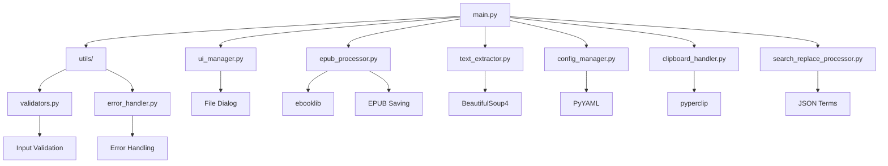

# ChapterClip - EPUB Processor

A Python CLI tool for extracting text from EPUB files and applying search-replace operations, with direct EPUB file modification capabilities. It enables users to extract manageable portions of EPUB books starting from a specified chapter, with options for word-based or LLM token-based counting, and provides comprehensive search-replace functionality that can either be applied to extracted text or directly modify the EPUB file itself.

## Overview

ChapterClip is designed to provide readers with comprehensive EPUB processing capabilities, including text extraction from specified chapters and direct EPUB file modification through search-replace operations. It enables users to extract manageable portions of EPUB books for reading, note-taking, or text processing, while also offering the ability to modify EPUB files directly by applying search-replace terms across all content items with parallel processing for performance.

### Vision Statement
To provide readers and content creators with comprehensive EPUB processing tools that enable both text extraction for reading/note-taking and direct file modification through advanced search-replace operations, supporting both word and token counting modes with performance-optimized processing.

### Target Users
- Digital readers who want to extract specific portions of books
- Students needing to copy text segments for study purposes
- Researchers extracting book content for analysis
- Content creators who need clean text from EPUBs

## Features

- **EPUB File Selection**: GUI file picker dialog for EPUB selection with validation
- **Improved Chapter Detection**: Automatically excludes non-chapter content based on filename patterns, title prefixes, HTML titles, and content length filtering
- **Chapter Selection**: Numeric input for chapter number with title confirmation
- **Counting Mode**: Choose between word counting (default) or LLM token-based counting using Google Generative AI
- **Text Extraction**: Extracts complete chapters only, removes HTML tags, with configurable formatting options
- **Search and Replace**: Comprehensive term replacement supporting JSON-configured pairs with regex/non-regex, case sensitivity, whole-word matching, and game-specific settings
- **EPUB Modification**: Direct EPUB file processing with search-replace applied to all HTML items, parallel processing for performance
- **Post-Extraction Options**: Re-copy to clipboard, redo last extraction, or return to main menu
- **Redo Functionality**: Remembers last extraction parameters for quick re-run
- **Performance Optimizations**: Configurable parallel processing, content filtering by word count, exclusion keywords
- **Text Formatting**: Options for paragraph breaks, line breaks, empty line removal, and title deduplication
- **Warning Suppression**: Suppresses XML parsing warnings for cleaner output
- **Logging Configuration**: Configurable logging levels via config.yaml
- **Output Management**: Direct copy to system clipboard with extraction summary
- **User Interface**: Rich-formatted CLI menu system with progress indicators and settings UI
- **Cross-Platform**: Supports Windows, macOS, and Linux

## Counting Mode

ChapterClip supports two counting modes for determining text extraction limits: **words** and **tokens**.

### Word Counting
The default mode that counts individual words in the extracted text. This mode ensures backward compatibility with existing configurations and behavior.

### Token Counting
Uses LLM tokenization (via Google Generative AI) to count tokens instead of words. This is particularly useful for users working with AI models that have token-based limits rather than word limits.

### Configuration
Users can configure the counting mode through:
- **UI Config Menu**: Select option 2 (Configure settings) and choose the desired counting mode
- **config.yaml**: Set the `counting_mode` field to either `'words'` or `'tokens'`

### Dependencies and Fallback
Token counting requires the `google-generativeai` library. If this dependency is unavailable, the tool automatically falls back to word counting to ensure uninterrupted functionality.

**Backward Compatibility**: Existing installations default to word counting, preserving existing behavior unchanged.

## Architecture



The project follows a modular architecture with separate components for UI management, EPUB processing (including modification and saving), text extraction, configuration, clipboard handling, search-replace processing, input validation, and error handling. The EPUB saving flow enables direct file modification for term replacement operations.

## Installation

### Prerequisites
- Python 3.8 or higher

### Dependencies

#### Core Dependencies
Install the required packages using pip:

```bash
pip install ebooklib beautifulsoup4 pyperclip click rich pyyaml lxml
```

#### Optional Dependencies
- `google-generativeai`: Required for token-based counting (automatic fallback to word counting if unavailable)

#### Development Dependencies
- `pytest`: For running unit tests
- `pytest-mock`: For mocking in tests
- `python-dotenv`: For environment variable management

### Setup
1. Clone the repository:
   ```bash
   git clone https://github.com/username/chapterclip.git
   cd chapterclip
   ```

2. Install dependencies:
   ```bash
   pip install -r requirements.txt
   ```

3. Run the application:
    ```bash
    python main.py run
    ```

## Usage

Launch the application with:
```bash
python main.py run
```

### Main Menu
```
═══════════════════════════════════════════
           ChapterClip - EPUB Processor
═══════════════════════════════════════════

Please select an option:

   [1] Extract chapters from EPUB
   [2] Replace EPUB terms
   [3] Configure settings
   [4] View current settings
   [5] Exit

Enter your choice (1-5): _
```

### Chapter Extraction Flow
1. Select option 1
2. Choose an EPUB file via the file picker
3. Enter the chapter number to start from
4. Confirm the chapter title
5. Optional: Select a JSON file with search-replace terms
6. The tool extracts complete chapters up to the word/token limit and copies to clipboard
7. Post-extraction options: re-copy to clipboard, redo last extraction, or return to main menu

### EPUB Terms Replacement Flow
1. Select option 2
2. Choose an EPUB file via the file picker
3. Select a JSON file containing search-replace terms
4. Confirm the replacement operation
5. The tool processes all HTML items in the EPUB with parallel processing
6. Saves modified EPUB with "_TermsReplaced" suffix

### Settings Configuration
- Select option 3 to configure settings interactively
- Settings are persisted in `config.yaml`

### Settings View
- Select option 4 to view current configuration

## Configuration

Configuration is stored in `config.yaml` with comprehensive settings:

```yaml
settings:
  counting_mode: tokens
  enable_content_filtering: true
  enable_parallel_processing: true
  exclusion_keywords:
    - cover
    - info
    - toc
    - contents
    - copyright
    - acknowledgment
  fix_title_duplication: true
  include_chapter_titles: true
  last_epub_directory: ""
  last_extraction_params:
    counting_mode: tokens
    file_path: ""
    json_path: ""
    max_limit: 35000
    real_chapter_num: 0
  last_json_directory: ""
  log_level: INFO
  max_tokens: 35000
  max_words: 35000
  max_workers: 12
  min_word_count_threshold: 500
  preserve_paragraph_breaks: true
  remove_empty_lines: true
  remove_line_breaks: false
```

### Configuration Options

| Setting | Description | Default |
|---------|-------------|---------|
| `counting_mode` | Counting method ('words' or 'tokens') | 'words' |
| `max_words` | Maximum word count for extraction | 35000 |
| `max_tokens` | Maximum token count for extraction | 35000 |
| `include_chapter_titles` | Include chapter titles in output | true |
| `preserve_paragraph_breaks` | Maintain paragraph structure | true |
| `remove_line_breaks` | Remove line breaks within paragraphs | false |
| `remove_empty_lines` | Remove empty lines from output | true |
| `fix_title_duplication` | Prevent duplicate chapter titles | true |
| `enable_content_filtering` | Filter content by word count threshold | true |
| `min_word_count_threshold` | Minimum words for content inclusion | 500 |
| `exclusion_keywords` | Keywords to exclude from chapters | [cover, info, toc, contents, copyright, acknowledgment] |
| `enable_parallel_processing` | Use parallel processing for EPUB operations | true |
| `max_workers` | Maximum worker threads for parallel processing | 12 |
| `last_epub_directory` | Last directory used for EPUB selection | "" |
| `last_json_directory` | Last directory used for JSON selection | "" |
| `last_extraction_params` | Parameters from last extraction for redo functionality | {} |
| `log_level` | Logging level (DEBUG, INFO, WARNING, ERROR, CRITICAL) | INFO |

## Examples

### Basic Extraction
```
━━━━━━━━━━━━━━━━━━━━━━━━━━━━━━━━━━━━━━━
Selected Chapter Confirmation
━━━━━━━━━━━━━━━━━━━━━━━━━━━━━━━━━━━━━━━

Chapter 17: "The Journey Continues"

Is this the correct chapter? (y/n): y

━━━━━━━━━━━━━━━━━━━━━━━━━━━━━━━━━━━━━━━
Extraction Complete!
━━━━━━━━━━━━━━━━━━━━━━━━━━━━━━━━━━━━━━━

✓ Successfully extracted and copied to clipboard

Details:
  • Chapters included: 17-24 (8 chapters)
  • Total words: 19,850
  • Maximum allowed: 20,000

Press Enter to return to main menu...
```

### Post-Extraction Menu
After successful extraction, you have the following options:

```
Post-Extraction Options:
━━━━━━━━━━━━━━━━━━━━━━━━━━━━━━━━━━━━━━

[1] Re-copy text to clipboard
[2] Redo last extraction
[3] Return to main menu

Enter your choice (1-3): _
```

### EPUB Terms Replacement Example
```
━━━━━━━━━━━━━━━━━━━━━━━━━━━━━━━━━━━━━━
EPUB Terms Replacement
━━━━━━━━━━━━━━━━━━━━━━━━━━━━━━━━━━━━━━

Selected EPUB: example.epub
Selected JSON: terms.json
Loaded 45 search-replace terms.

Proceed with replacement? (y/n): y

━━━━━━━━━━━━━━━━━━━━━━━━━━━━━━━━━━━━━━
Processing EPUB...
━━━━━━━━━━━━━━━━━━━━━━━━━━━━━━━━━━━━━━

✓ Processed 156 HTML items with 2,847 replacements
✓ Saved as: example_TermsReplaced.epub

Press Enter to continue...
```

### Settings View
Select option 4 to view current configuration:

```
Current Settings:
━━━━━━━━━━━━━━━━━━━━━━━━━━━━━━━━━━━━━━━
Counting Mode: tokens
Max Words: 35000
Max Tokens: 35000
Include Chapter Titles: True
Preserve Paragraph Breaks: True
Remove Line Breaks: False
Remove Empty Lines: True
Fix Title Duplication: True
Enable Content Filtering: True
Min Word Count Threshold: 500
Enable Parallel Processing: True
Max Workers: 12
Log Level: INFO
Last EPUB Directory: /path/to/last/directory
Last JSON Directory: /path/to/json/directory
```

## Troubleshooting

### Common Issues

- **Invalid EPUB file**: Ensure the file is a valid EPUB (EPUB 2.0 or 3.0). The tool will display an error if the file is corrupted or not an EPUB.

- **Chapter not found**: Verify the chapter number exists in the EPUB. The tool shows available chapter ranges for invalid inputs.

- **Clipboard access denied**: On some systems, clipboard access may be restricted. The tool will offer to display text in the terminal as an alternative.

- **Corrupted EPUB structure**: For damaged files, the tool will attempt graceful degradation and show a warning about potential issues.

### Performance
- Standard EPUB files (<10MB) should process in under 5 seconds
- Ensure sufficient RAM for large EPUBs
- Close other memory-intensive applications if experiencing slowdowns

### Compatibility
- Requires Python 3.8+
- Tested on Windows, macOS, and Linux
- Supports UTF-8 encoded EPUBs

## Contributing

Contributions are welcome! Please feel free to submit pull requests or open issues for improvements.

## License

This project is licensed under the MIT License - see the [LICENSE](LICENSE) file for details.

## Future Enhancements

- Multiple EPUB batch processing
- Export to various formats (TXT, MD, DOCX)
- Reading progress tracking
- Chapter bookmarking
- Custom extraction patterns
- Integration with cloud storage
- GUI version using PyQt or Tkinter
- Advanced EPUB editing features
- EPUB metadata modification
- Integration with reading applications